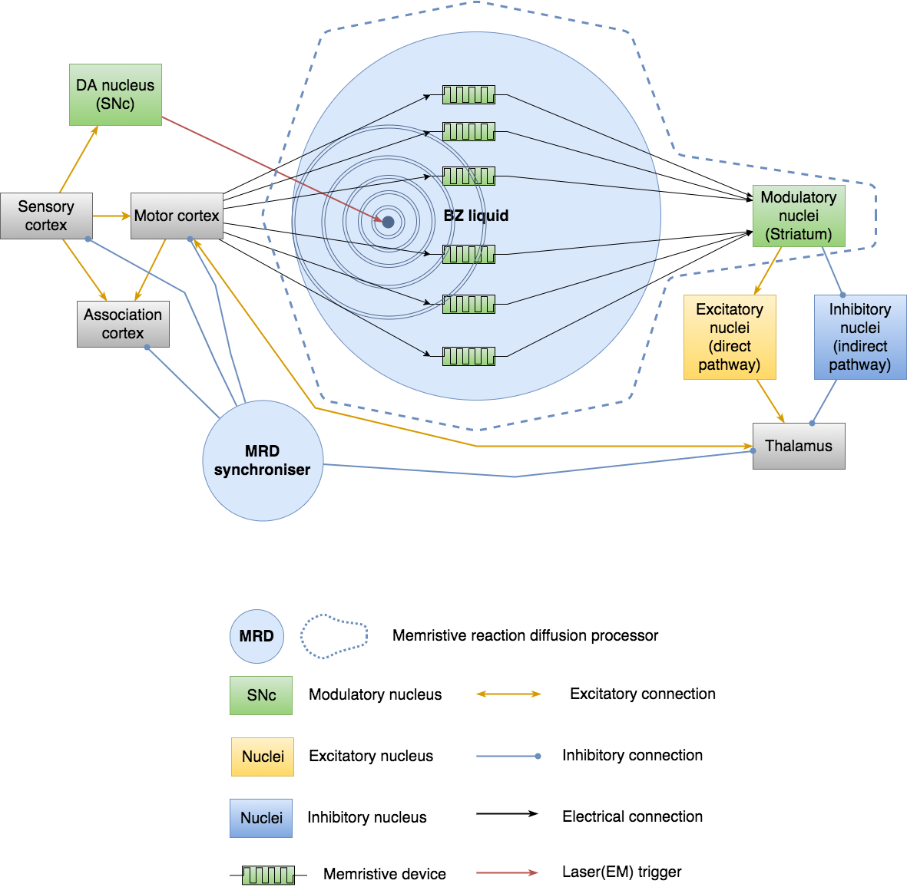

# Memristive reaction diffusion processor

Memristive devices provide interesting option to be used as electronic synapses, connecting even biological cells. It seems to be reasonable to create the analog schematic adopting metaphor of neuron cells with the richness of inhibitory and neuromodulatory mechanisms. The interest in neuromodulatory mechanisms is based on our previous research during [NeuCogAr](https://github.com/research-team/NEUCOGAR) project, that is dedicated to the reimplementation of psycho-emotional states and is based on the model of Hugo Lövheim ["cube of emotion"](https://en.wikipedia.org/wiki/L%C3%B6vheim_cube_of_emotion) and neuromodulators: dopamine, serotonin, noradrenaline.

# Neuron

Single neuron schematic is presented below: 

The complete description is available [here](https://github.com/research-team/memristive-brain/blob/master/doc/memristive-brain_technical_roadmap.md#neuron).

# Memristive reaction diffusion neuromodulation

Reaction diffusion computers are interesting alternative for traditional silicon processing units and their use in robotics was indicated by [Adamatzky 2005](#Adamatzky_2005) and [Fontana 2011](#Fontana_2011).

Overall schematic is inspired by [nigrostriatal pathway of the dopamine subsystem of the mammalian brain](https://en.wikipedia.org/wiki/Basal_ganglia#Circuit_connections). 
The modulating subsystem is inspired by dopamine modulation of striatum via D1, D2 receptors. DA nucleus (SNc - [substancia nigra compacta](https://en.wikipedia.org/wiki/Substantia_nigra)) triggers the [Belousov–Zhabotinsky (BZ) reaction](https://en.wikipedia.org/wiki/Belousov%E2%80%93Zhabotinsky_reaction) via laser and controls it via electromagnetic field [Adamatzky 2005]. The waves of the BZ reaction spreads through the reactor that contains the matrix of PANI devices [Fontana 2011]. The wave front of the maximum pH modulates increasing the conductivity of a PANI memristive devices.  

<b id="Adamatzky_2005">(Adamatzky 2005)</b> Adamatzky, A., Costello, B. D. L., & Asai, T. (2005). Reaction-diffusion computers. Elsevier. [↩](#a1)

<b id="Fontana_2011">(Fontana 2011)</b> Fontana, M. P., & Erokhin, V. (2011). Thin Film Electrochemical Memristive Systems for Bio-Inspired Computation. Journal of Computational and Theoretical Nanoscience, 8(3). https://doi.org/10.1166/jctn.2011.1695 [↩](#a2)

